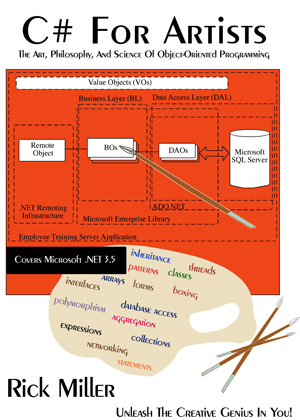

# CSharpForArtistsFirstEdition
Source code examples from the first edition of C# For Artists: The Art, Philosophy, and Science of Object-Oriented Programming.

This book is available to download free from Pulp Free Press.

<a href="https://pulpfreepress.com"></img></a>

